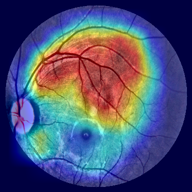
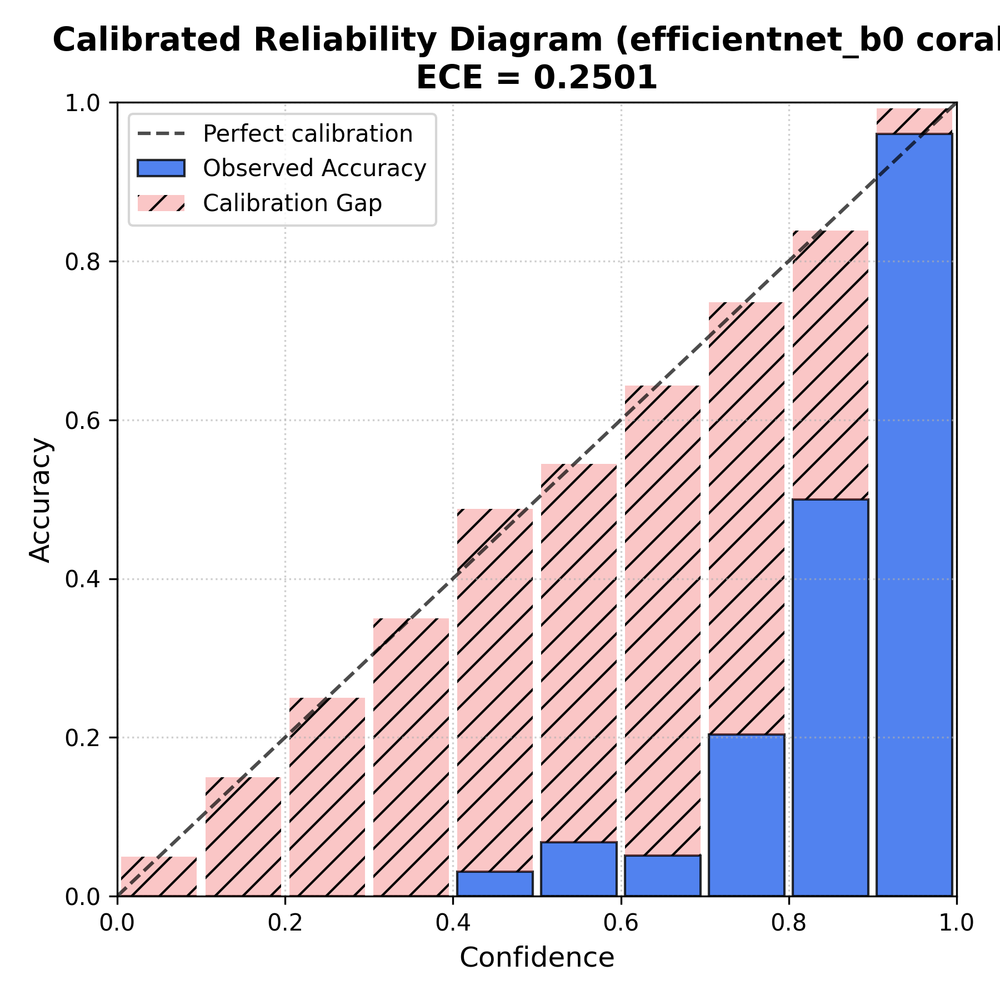

# Diabetic Retinopathy Severity Grading

[](https://www.python.org/downloads/)
[](LICENSE)
[](https://wandb.ai/muhammadshaiel-comsats-university-islamabad/dr-severity-grading)

I trained three EfficientNet-B0 models on the APTOS 2019 fundus image dataset to compare loss functions for ordinal 5-class severity grading. The main finding: weighted cross-entropy outperformed CORAL ordinal regression by a wide margin on a heavily imbalanced dataset, and understanding why turned out to be the most useful part of the project.

---

## Results

| Loss | Val QWK | Full-eval QWK | Val ECE | Temp (T) |
|---|---|---|---|---|
| Cross-entropy + class weights | 0.8980 | **0.9279** | 0.0428 | 1.000 |
| Focal loss (gamma=2.0) | 0.8964 | 0.9150 | 0.0348 | 1.050 |
| CORAL ordinal regression | 0.7383 | 0.7510 | 0.2641 | 1.269 |
| CORAL + temperature scaling | 0.7420 | 0.7680 | 0.2501 | 1.269 |

Full-eval QWK of 0.9279 and calibrated ECE of 0.0095 for the CE baseline are verified against `results/tables/aptos_efficientnet_b0_cross_entropy.csv`. Focal and CORAL numbers are from W&B training runs; see the note at the bottom.





---

## Problem

Diabetic retinopathy is graded on a 0-4 scale (no DR to proliferative DR). Automated grading is useful because it could extend screening to settings without enough ophthalmologists, but a model that ignores the ordering of the classes (predicting grade 4 when the true label is 0 is much worse than predicting grade 1) should be penalized accordingly. I wanted to test whether encoding that ordering through the loss function actually helps compared to standard approaches.

---

## Data

APTOS 2019 Blindness Detection (Kaggle). 3,662 labeled fundus images across five severity grades. The class distribution is lopsided: grade 0 (no DR) is about 49% of the training set, while grade 3 (severe) is around 5%. I used an 80/20 train/val split with stratification. No external data.

Preprocessing follows the Ben Graham method: circle-crop the fundus region, resize to 512x512, then apply CLAHE normalization. This removes camera border artifacts that would otherwise bleed into gradient-based explanations.

---

## Approach

**Baseline.** EfficientNet-B0 from `timm`, fine-tuned end-to-end with weighted cross-entropy. Class weights are set to N / (K * N_c), the inverse-frequency formula, which directly counteracts the grade-0 majority at gradient level.

**Focal loss ablation.** I replaced the loss with focal loss (gamma=2.0) to see whether down-weighting easy negatives was more effective than reweighting by class. It performed slightly worse than weighted CE on QWK (0.8964 vs. 0.8980) and had better raw calibration (ECE 0.0348). The two approaches are not mutually exclusive; combining them is an obvious next step.

**CORAL ordinal regression.** CORAL reformulates the 5-class problem into four binary "grade >= k" classifiers that share a single weight vector but have independent bias terms. This guarantees rank consistency mathematically: P(grade >= 4) <= P(grade >= 3) by construction. I chose it because it is a principled way to encode ordinal structure without treating class labels as arbitrary categories.

The problem: standard CORAL uses no threshold-level reweighting. Under extreme imbalance, the shared weight vector drifts toward grade 0, and the four binary thresholds all fire conservatively. The result was a 15-point QWK drop versus the baseline. Temperature scaling improved ECE from 0.2641 to 0.2501 but did not recover QWK. What would help: per-threshold loss weights (lambda_k) or threshold optimization after training.

**Training setup.** CosineAnnealingWarmRestarts scheduler, AdamW, Albumentations augmentations (flips, rotations, brightness/contrast), W&B logging, Hydra for config management. All three runs share the same backbone and augmentation pipeline, so the loss comparison is controlled.

**Explainability.** Grad-CAM targets EfficientNet's final convolutional block and overlays the activation map on the CLAHE-normalized input. The heatmaps tend to highlight microaneurysms and hemorrhage regions in higher-grade images rather than the image border, which is a sanity check that the model is attending to pathology.

---

## Results and analysis

Weighted CE is the best model by QWK, and it is well-calibrated out of the box (ECE 0.0428, T=1.0 means no scaling was needed). Focal loss is essentially equivalent on QWK with slightly better calibration, which suggests the two reweighting strategies are largely interchangeable on this dataset.

CORAL's underperformance is not a statement that ordinal regression is bad. It is a statement that ordinal regression with no imbalance handling is bad on imbalanced data. The rank-consistency guarantee is a real property, but it only matters if the model is also accurate. Per-class F1 for the CE baseline: grade 0 = 0.989, grade 1 = 0.698, grade 2 = 0.774, grade 3 = 0.559, grade 4 = 0.690. The minority classes are the hardest, which is expected.

---

## Limitations and what I would do next

The dataset is small (3,662 images) and single-source. The models have not been tested on a different fundus camera or patient population, so generalization is an open question. The Ben Graham preprocessing is sensitive to images where the fundus is not well-centered or the background is non-black, which applies to some APTOS images.

Given more time:

- Add per-threshold loss weights to CORAL to address the imbalance problem directly.
- Train EfficientNet-B3 (the config exists; I did not run it due to compute budget).
- Evaluate on Messidor-2 for out-of-distribution performance (also already in the config).
- Ensemble CE and CORAL predictions, since the two models may make different types of errors.
- Replace scalar temperature scaling with a method that handles class-level miscalibration separately.

---

## How to run it

Install dependencies:

```bash
pip install -r requirements.txt
```

Train the three models:

```bash
# Cross-entropy baseline
python scripts/train.py loss=cross_entropy model=efficientnet_b0 training=baseline

# Focal loss ablation
python scripts/train.py loss=focal model=efficientnet_b0 loss.gamma=2.0

# CORAL ordinal regression
python scripts/train.py loss=coral model=efficientnet_b0 training=ordinal
```

Run the unit tests:

```bash
pytest tests/ -v
```

Run the Gradio demo locally (downloads the CORAL checkpoint from Hugging Face):

```bash
python app/app.py
```

Live demo: [huggingface.co/spaces/mshaiel2004/dr-severity-grading](https://huggingface.co/spaces/mshaiel2004/dr-severity-grading)

---

## Project structure

```
dr-severity-grading/
├── configs/          # Hydra configs for model, loss, data, and sweeps
├── src/              # Core package: data, models, losses, training, evaluation, explainability
├── scripts/          # CLI entry points (train, eval, calibrate, predict)
├── app/              # Gradio demo
├── notebooks/        # EDA, calibration analysis, Grad-CAM, Colab pipeline
├── results/          # Saved figures and metrics CSV
├── tests/            # 22-item pytest suite
└── docs/             # CORAL loss derivation and lessons learned
```

---

## References and acknowledgments

- CORAL loss: Cao, Mirjalili, Raschka (2020). "Rank Consistent Ordinal Regression for Neural Networks." [arXiv:1901.07884](https://arxiv.org/abs/1901.07884)
- Ben Graham preprocessing: Graham (2015), Kaggle EyePacs competition writeup.
- APTOS 2019 dataset: [kaggle.com/c/aptos2019-blindness-detection](https://www.kaggle.com/c/aptos2019-blindness-detection)
- EfficientNet backbone via `timm` by Ross Wightman.
- Temperature scaling: Guo et al. (2017). "On Calibration of Modern Neural Networks." ICML.

Distributed under the MIT License. See [LICENSE](LICENSE).
